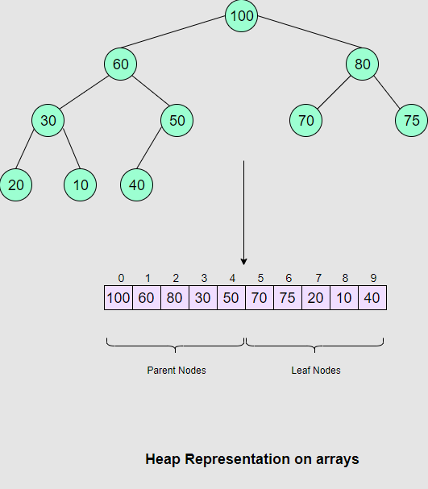

# Heaps

## Intro

Heaps are advanced data structures based on Binary Trees, which is why they are commonly known as **Binary Heaps**.

> ###  🔍 What is a Binary Heap?
>  A Binary Heap is a complete Binary Tree which satisfies the Heap ordering property.

All the nodes are ordered according to the rules listed below:

1. *A Heap tree must be a Complete Binary Tree*.
2. *The nodes must be ordered according to the Heap Property*.

**Common Misconception**

There is also a common misconception that the elements of a Heap are sorted. They are not at all sorted; in fact, the only key feature of a Heap is that the largest or smallest element is always placed at the top (parent node) depending on what kind of Heap we are using.

Moreover, this Data Structure `Heap` has nothing to do with the dynamic memory allocations on a Heap in various languages like C/C++ and Pascal.

1. **Complete Binary Tree**

   A Complete Binary Tree is a tree where each node has a max. of two children and nodes at all levels are completely filled (except the *leaf nodes*). But the nodes at the last level must be structured in such a way that the left side is never empty. This is the only condition that differentiates Complete Binary Trees from other trees.

   The new elements are inserted from left to right. When you add a new node, you must make sure that the left child of that intermediate parent node is filled. If it’s not, add a node at the left and insert the new element there.

2. **Heap Property**

   A heap is built, based on the Heap property, by comparing the parent node key with its child node keys. This comparison is done based on the heap property. The two heap structures that we are going to cover in this chapter are:

   - Min Heap
   - Max Heap

   Min Heap is built on the Min Heap property, and Max Heap is implemented on the Max Heap property. Let’s see how they are different.

   #### 2.1 Max Heap Property:

   This property states that all the parent node keys must be greater than or equal to their child node keys. So the root node, in this case, will always contain the largest element present in the Heap. If Node A has a child node B, then,
   $$
   key(A)>=key(B)
   $$

   #### 2.2 Min Heap Property:

   In Min Heap, all the parent node keys are less than or equal to their child node keys. This goes without saying that the rule will apply to all children of the node. So the root node, in this case, will always contain the smallest element present in the Heap. If Node A has a child node B, then,
   $$
   key(A)<=key(B)
   $$

## Why Use Heaps?

### Where are Heaps Used?

Just like other data structures, Heaps are also used in many computing algorithms. The major uses of Heaps are elaborated below:

1. **Order statistics:** Heaps are primarily used for efficiently finding the smallest or largest element in an array.
2. **Priority Queues:** Priority queues can be efficiently implemented using Binary Heap because it supports `insert()`, `delete()`, `extractmax()`, and `decreaseKey()` operations in **O(logn)** time. Binomoial Heaps and Fibonacci Heaps are variations of Binary Heaps. These variations also perform `union()` in **O(logn)** time, which is an **O(n)** operation in a Binary Heap. Heap-implemented priority queues are used in Graph algorithms like *Prim’s Algorithm* and *Dijkstra’s algorithm*.
3. **Sorting:** `HeapSort` uses the Heap data structure to sort values in exactly the same way as `TreeSort` used a Binary Search Tree.
   Each `insert()` and `delete()` operation is `O(logN)`. At the very worst - the heap does not always have all N values in it, so the complexity is certainly no greater than `O(NlogN)`. This is better than the worst-case for `TreeSort`, which–because you might build a degenerate Binary Search Tree-- is `O(N*N)`.
   HeapSort is especially useful for sorting `arrays` because Heaps, unlike almost all other types of trees - are usually implemented in arrays, not as linked data structures!

## Heap Representation in Arrays

Heaps can be implemented using Arrays. The contents of a heap with `n` nodes are stored in such a way that all the parent nodes occur in the first half of array (`n/2`), while the leaves are present at the last `n/2` positions. So the last parent will be at the `n/2th` position.

The node at the *kth* position will have its children placed as follows:

- The Left child at **2k+1**
- The Right child at **2k+2**.

See the figure below to see how nodes are mapped on the array:

In the figure above, you can see that all of the parent nodes are present in the first half of the array, with the last parent at the `n/2th` position (i.e. 4th index), whereas the children nodes appear on the second half. The following properties also hold:
$$
LeftChild=2k+1
\\
RightChild=2k+2
$$

## Max Heap: Introduction

### Building a Max-Heap

As mentioned in the previous lesson, a Max Heap follows the Max Heap property, which means the key at the parent node is always greater than keys at both child nodes. The following steps illustrate how we build a Max Heap:

1. Create a new node at the end of the heap.
2. Assign a new value to the node.
3. Compare the value of this child node with its parent.
4. If the value of the parent is less than that of the child, then swap them.
5. Repeat steps 3 & 4 until the Heap property holds.

### Implementing a Max-Heap

Heaps can be implemented using arrays. Initially, elements are placed in nodes in the same order as they appear in the array. Then a function is called over the whole Heap in a bottom-up manner, which “Max Heapifies” this Heap so that the Heap property is satisfied on all nodes.

When we say bottom-up we mean the function starts from the last parent node present at the n/2th position of the array, and it checks if the values at the child nodes are greater than the parent nodes.

### Insertion in Max-Heap

If you want to insert a new element in the Max Heap, you will have to follow a list of steps to make sure the Heap property still holds after adding the element. Here’s the list of steps that you will perform:

1. Create a new child node at the end of the heap.
2. Place the new key at that node.
3. Compare the value with its parent node key.
4. If the key is greater than the key at the parent node, swap values.
5. If both keys at the children nodes are greater than the parent node key, pick the larger one and see if the Heap property is satisfied.
6. Repeat until you reach the root node.

### Removing an Element from a Max-Heap

Deletion in a Max-Heap is mainly performed when you want to remove the largest element. In most of the cases, the purpose of a Heap is to work as a priority queue. As an example here, we will take the case of deleting the biggest element here as we are discussing Max Heaps. Given below is the list of steps you will follow to make sure the Heap Property still holds after deleting the root element:

1. Delete the root node
2. Move the key of the last child node at the last level to the root
3. Now compare the key with its children
4. If the key is smaller than the key at any of the child nodes, swap values
5. If both keys at the children nodes are greater than the parent node key, pick the larger one and see if the heap property is satisfied
6. Repeat until you reach the last level

For better understanding, here’s the visual representation of what we just said:

## Min Heap: An Introduction

### Building a Min-Heap

A Min Heap follows the Min Heap property, which means the key at the parent node is always smaller than keys at both children nodes.

Heaps can be implemented using arrays. Initially, elements are placed in nodes in the same order as they appear in the array. Then a function is called over the whole Heap in a bottom-up manner, which *“Min Heapifies”* this Heap so that the Heap property is satisfied on all nodes.

When we say bottom-up, we mean the function starts from the last parent node present in the *n/2th* position of the array, and checks if the values at the children nodes are smaller than the parent node. If yes, then swap the values; if no, then move to the next parent node.

### Insertion in Min Heap

If you want to insert a new element in a Min Heap, you will have to follow a list of steps to make sure the Heap property still holds after adding the element. Here’s the list of steps that you will perform:

1. Create a new child node at the end of the `heap`
2. Place the new key at that `node`
3. Compare the value with its parent `node` key
4. If the key is smaller than the `key` at the parent node, swap values
5. If both keys at the children nodes are smaller than the parent node key, then pick the smallest one and see if the `Heap` property is satisfied.
6. Repeat until you reach the `root` node

### Deletion in Min Heap

Deletion is performed in the same way as in Max Heap. We will take the case of deleting the smallest element here as we are discussing Min Heaps. Given below is the list of steps you will follow to make sure the Heap property still holds after deleting the root element:

1. Delete the `root node`
2. Move the `key` of the last child node (at the last level) to the root
3. Now compare the `key` with its children
4. If the `key` is greater than the `key` at any of the children nodes, swap values
5. If both keys at children nodes are smaller than the parent `node key`, pick the smallest one and see if the Heap property is satisfied.
6. Repeat until you reach the last level