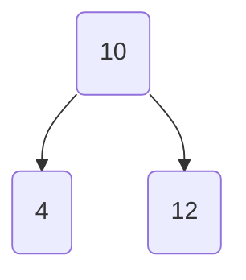
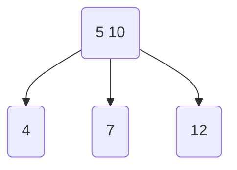
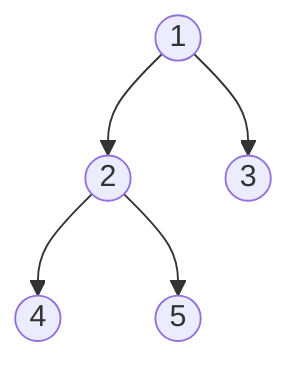
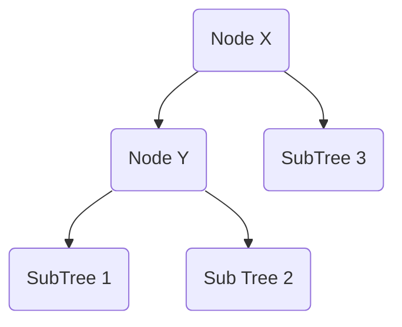
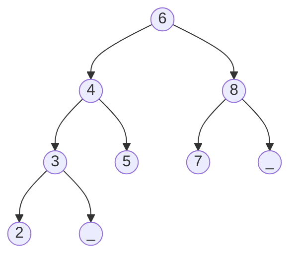
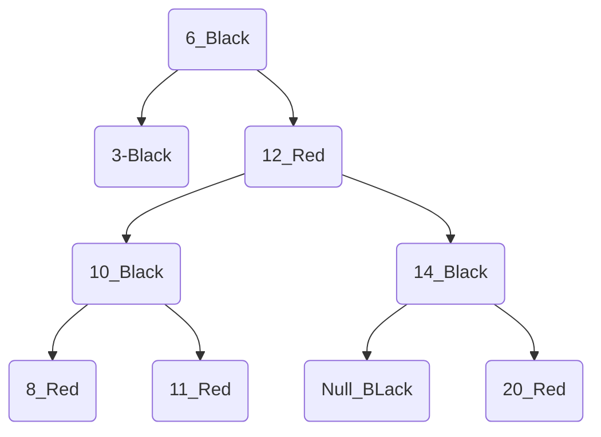
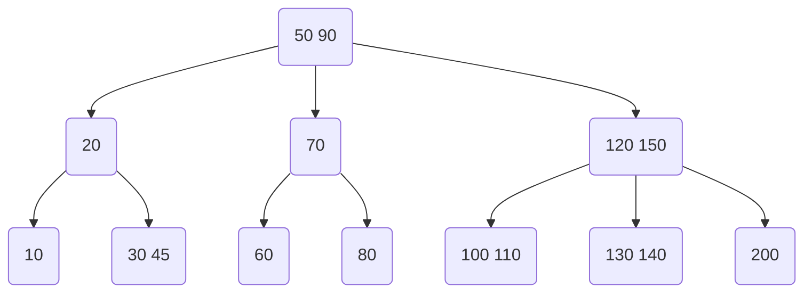

# Trees

## Introduction

In this lesson, we will learn a hierarchical data structure known as a **Tree**. A tree consists of **nodes** (vertices) that are connected using pointers (edges). Trees are similar to graphs; the key differentiating point is that a cycle cannot exist in a Tree.

The basic structure of a tree consists of the following components:

- **Nodes**: Hold data
- **Root**: The uppermost node of a tree
- **Parent Node**: A node which is connected to one or more nodes on the lower level (*Child Nodes*).
- **Child Node**: A node which is linked to an upper node (*Parent Node*)
- **Sibling Node**: Nodes that have the same *Parent Node*
- **Leaf Node** – A node that doesn’t have any *Child Node*

## Terminology Used in Trees

Here are some other common terminologies used in trees:

- **Sub-tree**:
  A subtree is a portion of a tree that can be viewed as a complete tree on its own. Any node in a tree, together with all the connected nodes below it, comprise a subtree of the original tree. Think of the sub-tree as an analogy for the term, **proper subset.**

- **Degree**:
  The degree of a node refers to the total number of *sub-trees* of a node

- **Depth**:
  The number of connections (edges) from the root to a node is known as the depth of that node.

- **Level**: 
  $$
  (DepthOfNode) +1
  $$
  
- **Height of a Node**:
  The maximum number of connections between the node and a leaf node in its path is known as the height of that node.
  
- **Height of a Tree**:
  The height of a tree is simply the height of its root node.

## Types of Trees

The most commonly used types are listed below:

- *N-ary Tree*
- *Balanced Tree*
- *Binary Tree*
- *BinarySearchTree*
- *AVL Tree*
- *Red-Black Tree*
- *2-3 Tree*

## N-ary Tree

In N-ary trees, each node can have child nodes anywhere from **0** to **N**. So if it’s a **2-ary** tree, commonly known as a **Binary Tree**, it can have a max. of **0-2** child nodes. Can you guess the value of N in the figure shown below?

## Balanced Tree

A balanced tree is a tree in which almost all leaf nodes are present at the same level. This condition is generally applied to all sub-trees. This means that all the sub-trees in a tree need to be balanced, no matter how many there are. Mathematically, it can be expressed as:
$$
Height(Tree)=O(log(nodes))
$$

Or in simpler words, make the tree “height-balanced”; i.e. the difference between the height of the left and right sub-trees of each node should not be more than **one.** Mathematically, it can be written as:
$$
∣Height(LeftSubTree)−Height(RightSubTree)∣<=1
$$

> A binary tree is height-balanced if, for each node in the tree, the difference between the height of the right subtree and the left subtree is at most one.

### Steps to Check if Tree is Balanced

This is the list of steps to follow to find out if a tree is balanced or not:

1. Start from the `leaf` nodes and move towards the `root`.
2. Along with traversing the tree, compute the heights of the **left-subtree** and **right-subtree** of each node. The height of a leaf node is always **0**.
3. At each node, check if the difference in height between the left and right sub-tree is **more than 1**; if so, then it means that the tree is not balanced.
4. If you have completely traversed the tree and haven’t caught the above condition, then it shows that the tree is balanced. (The height difference between the left and right sub-trees is NOT more than 1.)

 ## Binary Tree

### Types of Binary Trees

- *Complete Binary Tree*
- *Full Binary Tree*
- *Perfect Binary Tree*

### Complete Binary Tree

A Binary Tree is said to be *complete* if it satisfies the following properties:

- All levels are filled except possibly the last one

- Nodes at the last level are as far left as possible

- The maximum number of nodes in a complete binary tree of height **“h”** are expressed as 
  $$
  2 ^{h+1} - 1
  $$
  
- The total number of non-leaf nodes in a complete binary tree of height **“h”** are expressed as 
  $$
  2 ^{h} - 1
  $$
  
- The maximum number of leaf nodes in a complete binary tree of height **“h”** is expressed as 
  $$
  2 ^{h}
  $$
  
- The nodes are present in between the range of:

$$
2^h <Nodes<2^{h + 1} −1
$$

### Full Binary Tree

A **full** or **proper** Binary Tree has the following characteristics:

- Every node has **0** or **2** children. No node can have 1 child.
- The total number of nodes in a Full Binary Tree of height **‘h’** can be expressed as:

$$
2ℎ+1≤total number of nodes≤2^{(ℎ+1)}−1
$$

### Perfect Binary Tree

A Binary Tree is said to be ***Perfect*** if it is ***Full*** and ***Complete***. Also note that,

- The total number of nodes in a perfect binary tree of height **‘h’** are given as: 
  $$
  2^{(ℎ+1)}−1
  $$
  
- The total number of leaf nodes are given as ***2^h*** or ***(n+1)/2***  where **‘n’** is the number of nodes.

  

There are many other advanced trees derived from the basic structure of binary trees. Some of the most common ones are:

- Skewed Binary Tree
- Binary Search Tree
- AVL Tree
- Two-Three Tree

### Skewed Binary Tree

A **Skewed Binary Tree** is a type of Binary Tree where all nodes are shifted to either the **left** or **right** side. It can also be defined as a Binary Tree in which the number of children is firmly restricted to one at each node.

### Types of Skewed Binary Tree

There are two types of Skewed Binary Trees based on which side is dominated:

- ***Left-Skewed Binary Tree***
- ***Right-Skewed Binary Tree***

> Try your best to avoid such tree structures, especially in the case of a Binary Search Tree, as it will kill efficient searching (the core purpose of a Binary Search Tree).

## Binary Search Tree

A Binary Search Tree, also known as an ordered Binary Tree, is a variant of a Binary Tree with a **strict condition** based on `node` value.

For all the nodes in a BST, the values of all the nodes in the left sub-tree of the current node are less than or equal to the value of the node itself. All the node values in the right subtree are greater than the value of the current node. This is referred to as the BST rule.
$$
NodeValues(LeftSubtree)<=CurrentNodeValue<NodeValues(RightSubTree)
$$

###  Deletion in Binary Search Trees

- Deletion at Leaf Node: Search and delete
- Deletion at Parent Node
  - Node has only **one** child: Search and delete, take the *deleted* parent-node’s child and link it with the parent node of the *deleted* node.
  - Node has **two** children: 
    1. Start by traversing the **right subtree** of the soon-to-be deleted parent node in such a way that you reach the **left-most** value—the value that will appear to be the **smallest** value in the whole subtree.
    2. Replace the value of the *node*, found in the last step, with the *parent’s* node value.
    3. Finally, **delete** the leaf node.

## AVL Tree

**AVL** trees are a self-balanced special type of Binary Search Tree with just **one** exception:

*For each Node, the maximum height difference between the left and right sub-trees can only be one.*

### Time Complexity

In the case of BST, the **Big(O)** of all three basic operations (*Insertion*, *Deletion*, and *Searching*) takes **O(h)** time, where *“h”* is the **height** of a Binary Search Tree.

In the case of *Skewed Trees*, the complexity becomes **O(n)**, where *“n”* is the number of nodes in the tree. Now to improve time complexity, We have to manage the height of the tree to improve time complexity, such that we can bring the time down to **O(logn)** for performing these basic operations.

### When to use AVL Trees?

As *AVL* are strictly balanced, **AVL** Trees are preferred in those applications where the *lookup* is the  most *vital*

## AVL Insertion

*Insertion* for an AVL tree follows the same steps that we covered in BST *insertion*.

*The **main** step comes after insertion when the tree gets unbalanced*.

To *re-balance* the tree, we need to perform some kind of rotation (*left* or *right*).

 some of the *terms* which we will be using while re-balancing the tree.

- **Node U** – an *unbalanced* node
- **Node C** – *child* node of **node U**
- **Node G** – *grandchild* node of **node U**

### Types of rotations

To rebalance the tree, we will perform *rotations* on the subtree with **Node U** as being the **root** node.

There are **two** types of rotations:

- left
- right

### Insertion Cases

We came across *four* different scenarios based on the arrangements of **Nodes U, C** and, **G**.

- **Left-Left:** Node **C** is the *left-child* of Node **U**, and Node **G** is the *left-child* of Node **C**.
- **Left-Right:** Node **C** is the *left-child* of Node **U**, and Node **G** is the *right-child* of Node **C**.
- **Right-Right:** Node **C** is the *right-child* of Node **U**, and Node **G** is the *right-child* of Node **C**.
- **Right-Left:** Node **C** is the *right-child* of Node **U**, and Node **G** is the *left-child* of Node **C**.

#### Case 1: Left-Left

In the **left-left** case, we only need to make a *single* rotation towards the **right** at **Node U** to balance the **AVL** tree. 

#### Case 2: Left-Right

In the **left-right** case we need to make *two* rotations:

- First is a *left* rotation at Node **C**.
- Second is a *right* rotation at Node **U**.

These two rotations balance the **AVL** tree. In this case, Node **G** becomes the *parent* node of both Node **C** and **U**.

#### Case 3: Right-Right

The **right-right** case is just like the *left-left* case. The only difference is that instead of rotating *right*, we need to make a *single* rotation towards the **left** at Node **U** to balance the **AVL** tree. In the final balanced version, **Node C** becomes the *parent* node of Node **G** and **U** and its *two* subtrees become balanced.

#### Case 4: Right-Left

The **right-left** case is similar to the *left-right* case. The only difference is that the two rotations performed are as follows:

- First is a *right* rotation at Node **C**.
- Second is a *left* rotation at Node **U**.

These two rotations balance the **AVL** tree. In this case, Node **G** becomes the *parent* node of both Node **C** and **U**.

### Time Complexity

Considering that it takes constant time to do *left-right* rotation operations and update the height to get a balanced tree, the time complexity of an **AVL** insert remains the same as BST insert: **O(h)** where **h** is the height of the tree. However, since the **AVL** tree is balanced, the height is **O(logn)**; so the time complexity of an AVL insert is **O(logn)**

## AVL Deletion

*Deletion* is similar to **AVL’s** *insertion* operation with just **one** exception:

*The deletion operation adds an extra step after the insertion method’s rotation and balancing of the first unbalanced node.*

After fixing the **first** *unbalanced* node through rotations, start moving **up** and fix the next *unbalanced* node. Keep on fixing the *unbalanced* nodes until you reach the **root**.

### Steps for Deletion

The following are the detailed steps for *removing* value from **AVL Trees**.

#### Step 1: Delete currentNode

Delete the *currentNode* in the same way as we did in **BST** *deletion*. At this point, the tree will become *unbalanced*, and we would need to perform some kind of *rotation* (**left** or **right**) to *rebalance* the tree.

#### Step 2: Traverse Upwards[#](https://www.educative.io/module/page/Z4JLg2tDQPVv6QjgO/10370001/6546848606322688/5236379543142400#Step-2:-Traverse-Upwards)

Start traversing from *currentNode* upwards till you find the **first** *unbalanced* node.

- **Node U** — an **unbalanced** node
- **Node C** — **child** node of node **U**
- **Node G** — **grandchild** node of node **U**

#### Step 3: Rebalance the Tree

To *rebalance* the tree, we will perform rotations on the *subtree* where **U** is the *root* node.

There are **two** types of rotations:

- left
- right

We came across **four** different scenarios based on the arrangements of Nodes **U**, **C** and, **G**.

- **Left-Left:** Node **C** is the *left-child* of Node **U**, and Node **G** is the *left-child* of Node **C**.
- **Left-Right:** Node **C** is the *left-child* of Node **U**, and Node **G** is the *right-child* of Node **C**.
- **Right-Right:** Node **C** is the *right-child* of Node **U**, and Node **G** is the *right-child* of Node **C**.
- **Right-Left:** Node **C** is the *right-child* of Node **U**, and Node **G** is the *left-child* of Node **C**.

After performing a successful rotation for the **first** *unbalanced* Node **U**, traverse up and find the next *unbalanced* node and perform the same series of operations to *balance*. Keep on balancing the *unbalanced* nodes from **first** Node **U** to *ancestors* of Node **U** until we reach the **root**. After that point, we will have a **fully** balanced **AVL Tree**

## Red-Black Tree

**A Red-Black Tree** is another type of self-balancing Binary Search Tree, just like the *AVL Trees* , but with some *additions*. The nodes in a **Red-Black Tree** are colored to either **red** or **black**. *Colored* nodes help in re-balancing the tree after *insertion* or *deletion*. 

### Properties of Red-Black Trees

- Every node has either **Red** or **Black** color.
- The root is always colored **black**.
- Two **red** nodes cannot be *adjacent*, i.e. **no** *red* parent can have a *red* child and vice versa.
- Every path from the *root* to a *leaf* must contain the exact same number of **black-colored** nodes.
- Every *null* node is considered to be **black** in color.

### Time Complexity

Balancing the tree doesn’t result in a tree being perfectly balanced, but it is good enough to get the time complexity close to **O(logn)** for basic operations like *searching*, *deletion*, and *insertion*.

### AVL vs Red-Black Trees

Although *AVL Trees* are more balanced than **Red-Black Trees**, *AVL Trees* take **more** rotations during *insertion* and *deletion* operations than **Red-Black** Trees. So, if you have a search-intensive application where *insertion* and *deletion* are not that frequent, then use *AVL Trees*. Otherwise, use **Red-Black** Trees for those applications involving more *insertions* and *deletions*.

## Red-Black Tree Insertion

The following are the steps involved in *inserting* value into a Red-Black Tree:

1. Insert *currentNode* using the standard BST insertion technique that we studied earlier, and make currentNode **red**.
2. If *currentNode* is the root, then change the color of *currentNode* to **black**.
3. If *currentNode* is not the *root*, then we will have to perform some operations to make the tree follow the **Red-Black** property.

### Rebalancing the Tree

To balance an *unbalanced* tree, we have **two** techniques which are used depending on some conditions that we will discuss shortly. The **two** techniques are:

1. **Recoloring Nodes**.
2. **Rotating Nodes (left or right)**.

*First*, we need to *define* the structure of the Red-Black Tree and some nodes relative to the *currentNode*, which is the node that we inserted in the Red-Black Tree.

- Node C – newly inserted node (*currentNode*)
- Node P – parent of *currentNode*
- Node G – grandparent of *currentNode*
- Node U – uncle of *currentNode* / sibling of Node P / child of Node G

If *currentNode* is not a root, and the parent of *currentNode* is not **black**, first, we will check Node U (the *uncle* of *currentNode*). Based on Node U’s color, we will perform some steps to make the tree balanced. If Node U is **red**, then do the following:

1. Change the color of Node P and U to black
2. Change the color of Node G to red
3. Make Node G the *currentNode* and repeat the same process from step two

If Node U (*uncle*) is **black**, then we come across four different scenarios based on the arrangements of Node P and G, just like we did in AVL trees. We will cover each of these scenarios

- Left-Left: Node P is the *leftChild* of Node G, and *currentNode* is the *leftChild* of Node P
- Left-Right: Node P is the *leftChild* of Node G, and *currentNode* is the *rightChild* of Node P
- Right-Right: Node P is the *rightChild* of Node G, and *currentNode* is the *rightChild* of Node P
- Right-Left: Node P is the *rightChild* of Node G, and *currentNode* is the *leftChild* of Node P

#### Case 1: Left-Left

When Node P is the *leftChild* of Node G, and *currentNode* is the *leftChild* of Node P, we perform the following steps:

1. Rotate Node G towards the Right
2. Swap the colors of Nodes G and P

#### Case 2: Left-Right

When Node P is the *leftChild* of Node G, and currentNode is the *rightChild* of Node P, we perform the following steps:

1. Rotate Node P towards the Left
2. After that, repeat the steps that we covered in Left-Left case

#### Case 3: Right-Right

When Node P is the *rightChild* of Node G, and *currentNode* is the *rightChild* of Node P, we perform the following steps:

1. Rotate Node G towards the Left
2. Swap the colors of Nodes G and P

#### Case 4: Right-Left

When Node P is the *rightChild* of Node G, and *currentNode* is the *leftChild* of Node P, we perform the following steps:

1. Rotate Node P towards Right
2. After that, repeat the steps that we covered in Right-Right case

### Conclusion for insert:

- Assume Current C Red, insert like BST, if it is root, change it to Black.
- Check parent P
  - If it is Black, just add after P
  - If P is Red, Check the Uncle U
    - If U is red, Change P and U to be Black, and grandparent G to be the Current C and Red. And repeat the same process.
    - If U is black, we would perform some rotation base on scenarios:
      - Left-Left: 
        1. Rotate Node G towards the Right
        2. Swap the colors of Nodes G and P
      - Left-Right: 
        1. Rotate the Node P to the Left
        2. Repeat the steps in Left-Left case
      - Right-Right: 
        1. Rotate Node G towards the Left
        2. Swap the colors of Nodes G and P
      - Right-Left: 
        1. Rotate the Node P towards Right
        2. Repeat the steps in Right-Right case

## Red-Black Tree Deletion

### Steps for Deletion

Following are the steps involved to remove any value in a Red-Black Tree:

1. Search for a node with the given value to remove. We will call it *currentNode*
2. Remove *currentNode* using standard BST deletion operation that we studied earlier

We already know that for deletion in BST, we always end up deleting either a leaf node or a node with only one child.

- In the case of leaf node deletion, it is easy to just delete the node and link the parent of the node to be deleted with null
- In the case of a node with one child, deletion is relatively easy as we just link the parent of the node to be deleted with that one child

Let’s name some nodes relative to Node C, which is the node that we want to delete:

- Node C – node to be deleted (*currentNode*)
- Node P – parent node of *currentNode*
- Node S – sibling node (once we rotate tree, Node R will have a sibling node which we name as Node S)
- Node SC – child node of Node S
- Node R – node to be replaced with *currentNode* and linked with Node P (Node R is the single child of Node C)

### Deletion Cases

1. Now we will take a look at some of the deletion cases and see what steps should be performed in each of these cases to make the tree balanced again. Given below is the first case in which Node C or Node R is red. In this type of scenario, we make Node R black and link it to Node P.

2. The second case is if both Node C and Node R are black, then make Node R black. Now Node R is double black, i.e. it was already black, and when both Node C and Node R are black, then we make Node R black again. Remember that null is always considered to have a black color.

Now we will convert Node R from double to single black.

We need to perform the following steps while Node R is double black and not the root of the Tree. Use the specifications that Node S (sibling of Node R) is black and one or both of Node S children are red:

- Left-Left: Node S is the *leftChild* of Node P, and Node SC (red) is the *leftChild* of S, or both children of S are red.
- Right-Right: Node S is the *rightChild* of Node P, and Node SC (red) is the *rightChild* of S, or both children of S are red.
- Left-Right: Node S is the *leftChild* of Node P and Node SC (red) is the *rightChild* of S.
- Right-Left: Node S is the *rightChild* of Node P and Node SC (red) is the *leftChild* of S.

#### Case 1: Left-Left

In the case when Node S is the *leftChild* of Node P, and Node SC (red) is the *leftChild* of S or both children of S are red, we perform the following steps:

1. Rotate Node P towards the right
2. Make the right child of Node S the left child of Node P

#### Case 2: Right-Right

In the case when Node S is the *rightChild* of Node P, and Node SC (red) is the *rightChild* of S or both children of S are red, we perform the following steps:

1. Rotate Node P towards the left
2. Make the left child of Node S the right child of Node P

#### Case 3: Left-Right

In the case when Node S is the *leftChild* of Node P and Node SC (red) is the *rightChild* of S, we perform the following steps:

1. Rotate Node S towards the left
2. Rotate Node P towards the right

### Case 4: Right-Left

In the case when Node S is the *rightChild* of Node P and Node SC (red) is the *leftChild* of S, we perform the following steps:

1. Rotate Node S towards the right
2. Rotate Node P towards the left

## 2-3 Tree

A 2-3 Tree is another form of a search tree, but it is very different from a Binary Search Tree. Unlike BST, 2-3 Tree is a balanced and ordered search tree that provides a very efficient storage mechanism to guarantee fast operations. We will take a detailed look at a 2-3 Trees’s structure, the limitations it follows, and how elements are inserted and deleted from it.

One key feature of a 2-3 Tree is that it remains balanced, no matter how many insertions or deletions you perform. The leaf nodes are always present on the same level and are quite small in number. This is to make sure the height doesn’t increase up to a certain level as the time complexity of all the operations is mainly dependent upon it. Ideally, we want the height to be in logarithmic terms because the tree will require more time to perform operations as it grows larger. In 2-3 Trees, the height is logarithmic in the number of nodes present in the tree. They generally come in 2 forms:

- *2 Node Tree*
- *3 Node Tree*

See the figures below to get an idea of how they are different. The first figure is a 2-3 Tree with only two nodes. To keep it ordered, the left child key must be smaller than the parent node key. Similarly, the right child key must be greater than the parent key.

The next shows a **3-node** tree where each node can contain a maximum of two keys and three children. Here, the parent node has 2 keys and 3 children (all at the same level). Let’s say the first key at a parent node is **X** and we call the second one **Y**. As shown in the figure, **X** key is greater than the left child and **Y** key is smaller than the right child key. The middle child has the value that is greater than **X** and smaller than **Y**.

Concluding from the explanation above, 2-3 Trees acquire a certain set of properties to keep the structure balanced and ordered. Let’s take a look at these properties.

### Properties

- All leaves are at the same height.

- Each internal node can have either 2 or 3 children.

- If the node has one key, it can either be a leaf node or have exactly two children. Therefore, if we say **X** is the key, and LChild and RChild refer to the left and right child of the node respectively, then,
  $$
  LChild.Key<X<RChild.Key
  $$
  

- If the node has two keys, it can either be a leaf node or have exactly three children. Therefore, if we say **X ** and **Y** are the keys present at a node and LChild and RChild refer to the left and right child of the node respectively, then,
  $$
  LChild.Key<X<MChild.Key<Y<RChild.Key
  $$
  

- Finally, the height of a 2-3 Tree with *n* number of nodes will always be lesser than:
  $$
  log_2(n+1)
  $$

### Operations

The basic operations of 2-3 Trees are:

- Search
- Insertion
- Deletion

The time complexity of all three operations will also be in logarithmic terms. So, they can be implemented to run in time **O*(*logn)**, where *n* is the number of nodes.

## 2-3 Insertion

### Introduction

Insertion in 2-3 Trees is a lot different from Binary Search Trees. In 2-3 Trees, values are only inserted at leaf nodes based on certain conditions. As discussed before, the insertion algorithm takes **O(Logn)** time where *n* is the number of nodes in the tree. Searching for an element is done in **Logn** and then insertion takes a constant amount of time. So, the overall time complexity of the insertion algorithm is **O(Logn)**.

## Insertion Algorithm

The insertion algorithm is based on these scenarios:

- If the tree is initially empty, create a new leaf node and insert your value.
- If the tree is not empty, traverse through the tree to find the right leaf node where the value should be inserted.
- If the leaf node has only one value, insert your value into the node.
- If the leaf node has more than two values, split the node by moving the middle element to the top node.
- Keep forming new nodes wherever you get more than two elements.

## 2-3 Deletion of Element at Leaf Node

### Deletion Algorithm

The deletion algorithm also takes **O(Logn)** time and begins from the leaf node, just like an insertion. The deletion in 2-3 Trees is performed based on these scenarios:

### Case 1: Element at Leaf

When the element which needs to be removed is present at the leaf node, we check how many keys are present in that node. The further divides the algorithm into two scenarios:

#### Leaf node has more than one key

If the leaf of the element to be deleted has more than one key, then simply delete the element.

#### Leaf node only has one key

If the leaf node of the element to be removed has only one key, then we will have to adjust the keys of that sub-tree in such a way that it remains ordered and balanced. This condition is further divided into two scenarios:

1. #### Any of the siblings has two keys

   Siblings are the other adjacent leaf nodes that share the same parent. A node could have one or two siblings depending upon its position. Check how many keys are present at the left or right sibling nodes. If any of the siblings have more than one key, then your problem is solved. All you need to do is move an element from the sibling node to the parent node, and shift down a node from the parent to your node. This process is called *Redistribution by Rotation* and it can be performed in two ways:

   **Rotation from Left Sibling**

   In this case, we lend a key from the left sibling by shifting the key with the largest value up to the parent node; then we move the parent node key (most right) down to our node.

   **Rotation from Right Sibling**

   In this case, we lend a key from the right sibling by shifting the key with the smallest value up to the parent node; then we move the parent node key (most left) down to our node.

   

2. #### No sibling has more than one key

   - In the case when none of the siblings have more than one key, we have no other option but to merge the two nodes by rotation of keys. So we merge two child nodes into one node by rotating elements accordingly. This process is called *Merge by Rotation*.
   - If there’s a case where the child nodes have more than one key, we shift an element from the child node to make it the parent node. When we are left with only one key at each child node, then we are bound to delete the node.

## 2-3 Deletion of Element at Internal Node

### Case 2: Element at Internal Node

Deletion is always performed at the leaf. So, whenever we need to delete a key at the internal node, we swap the key with any of its in-order successors; somehow we make it shift to any leaf node, as deletion is always performed at the *leaf*. Shift the element at the leaf node and then delete it. The element to be deleted can be swapped by either of the following:

- an element with the largest key on the *left*
- an element with the smallest key on the *right*

This is applicable when the child node has more than one key stored at the node. If there is only one value at the child node, then you are bound to swap the parent with whatever value the child node has.

## 2-3-4 Trees

### Introduction

2-3-4 is a search tree which is an advanced version of 2-3 Trees. This tree can accommodate more keys and hence more child nodes as compared to 2-3 Trees. Likewise, a 2-3-4 Tree satisfies all the properties covered in 2-3 Trees as well as some additional key features:

- Each internal node can contain a max. of three keys

- Each internal node can have a max. of four child nodes

- In the case of three keys (*left*, *mid*, and *right*) at an internal node, all the keys present at the *LeftChild* node are smaller than the left key. This can be mathematically expressed as,
  $$
  LeftChild.keys<LeftKey
  $$

- All the keys present at the *LeftMidChild* node are smaller than the *mid key*, which can be mathematically expressed as,
  $$
  LeftMidChild.keys<MidKey
  $$

- All the keys present at the *RightMidChild* node are smaller than the *right key*, which can be mathematically expressed as,
  $$
  RightMidChild.keysey<X<RightKey
  $$

- Finally, all the keys present at the *RightChild* node are greater than the *right key*, which can be mathematically expressed as,
  $$
  RightChild.keys>RightKey
  $$

## Conclusion

### Binary Trees

**Definition:** A tree having a max. of two children at each internal node

**Types:** Perfect, Full, Complete, Skewed

**Total number of leaf nodes:** 
$$
2^h or \frac{n + 1}{2}
$$

**Height:** 
$$
log_2(n+1) -1
$$

**Height:** 
$$
O(log_2n)
$$

### Binary Search Trees

**Definition:** Every node has a value greater than/equal to all the node values in its left sub-tree, and has a value less than all the node values in its right sub-tree. Mathematically,
$$
Keys(SubTree1)<Keys(Y)<Keys(Subtree2)<Keys(X)<Keys(SubTree3)
$$

### Red Black Trees

**Definition:**  A tree where every node is colored as red or black, no two adjacent nodes have *red* coloring, and root and null nodes are considered *black*.

**Height:** 
$$
h<=2log_2 (n+1)
$$

**Minimum number of nodes:**
$$
N(h)=1+N(h-1)+N(h-2)
$$

### AVL Trees

**Definition:** For each node, the height of the left and right *sub-trees* differ by a max. of one.

**Height:** 
$$
h<=2log _2(n+1)
$$

**Minimum number of nodes:**
$$
(ℎ+1)+2\sum_{i=0}^{y}2^i - 1, \quad where \quad y\quad is \quad equal \quad to: \bf{floor(h/2)}
$$

### 2-3 trees

**Definition:** A balanced and ordered tree where each node can have a max. of two keys (X and Y) and three children, such that,
$$
LChild.Key < X < MChild.Key < Y < RChild.Key
$$

**Maximum number of nodes:** 
$$
3^h
$$

**Height:** 
$$
log_4(n+1)−1<h<log_2(n+1)−1
$$

**Types:** *2-3-4 Trees*

